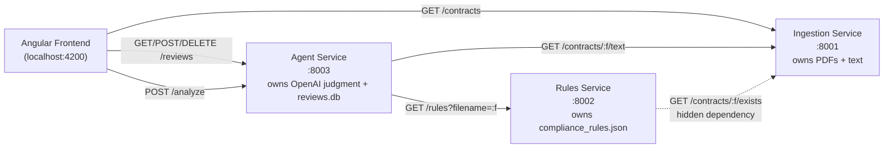

# ContractIQ Microservices — High-Level Design

Companion to [`ContractIQ_Microservices_Spec.md`](../ContractIQ_Microservices_Spec.md).
That file is the original brief; this document describes what was actually
built, including the pieces added after the initial spec (review-outcome
persistence, the reset endpoint) and the one place the build diverges from
the spec's literal text (noted below).

## Purpose

A three-service split of the ContractIQ monolith (`app.py`), built as a
guided training exercise: the same contract-review domain, but now with
real network boundaries between "who owns the PDF," "who owns the rules,"
and "who owns the judgment." Two failure modes are deliberately designed in
so trainees discover them by tracing calls rather than reading a diagram:
a stale API doc, and a hidden service-to-service dependency.

## System overview



Every request/response carries a `trace` array; each service appends one
entry describing its own hop before returning. Agent Service aggregates the
full trace — including the nested Rules→Ingestion hop it never directly
initiated — and hands it to the frontend, which reconstructs and animates
it as a graph (see [Frontend](#frontend-angular) below).

## Services

### Ingestion Service (`ingestion-service/`, port 8001)

Owns the PDFs and text extraction — nothing else. No contract-type
classification, no metadata map, no per-file hardcoding of any kind; `GET
/contracts` is a live scan of the `contracts/` folder, so dropping a new
PDF in and re-hitting the endpoint just works.

| Endpoint | Behavior |
|---|---|
| `GET /contracts` | `[{filename}]` — plain directory scan, no `trace` field (bare array) |
| `GET /contracts/{filename}/text` | Extracts text via `extract_contract_text()` (reused verbatim from `analyze_contract.py`); 404 if the file isn't there |
| `GET /contracts/{filename}/exists` | Boolean existence check, always 200. Used only by Rules Service |

### Rules Service (`rules-service/`, port 8002)

Owns `compliance_rules.json` (copied verbatim). Two intentional gotchas
live here:

1. **Stale contract doc.** `rules-service/README.md` documents the
   response as `severity: "high"|"medium"|"low"` (a string). The real
   response uses `severity_code: 1|2|3` (int). The docs were never updated
   after a refactor — Agent Service has to map codes to labels itself, and
   a trainee who trusts the README over the actual response gets it wrong
   immediately.
2. **Hidden dependency.** Before returning a rule set, Rules Service calls
   **Ingestion Service** (`GET /contracts/{filename}/exists`) to verify the
   filename is real, rather than trusting the caller. This is invisible
   from reading Agent's code — it only calls Rules — and only surfaces by
   tracing into Rules Service itself or watching the trace panel. If the
   existence check fails, Rules Service 404s instead of returning rules.

| Endpoint | Behavior |
|---|---|
| `GET /rules?filename={filename}` | Verifies the filename via Ingestion, then returns the **same universal rule set for every contract** (flattened from `compliance_rules.json`: required clauses + prohibited terms at `severity_code=1`, risk thresholds at `2`, escalation rule at `3`) with a two-hop trace (Ingestion's `exists` entry, then Rules' own entry) |

### Agent Service (`agent-service/`, port 8003)

Owns the OpenAI call/judgment logic (reused from `analyze_contract.py`)
**and**, as of the post-build extension, review-outcome persistence. Two
concerns, one service, because Agent already owns "judgment" and recording
outcomes (manual or agent) is a natural extension of that rather than a new
concern meriting a fourth service.

**Analysis:**

| Endpoint | Behavior |
|---|---|
| `POST /analyze {filename}` | Calls Ingestion for text, calls Rules for rules (mapping `severity_code`→label locally), runs the reused OpenAI prompt/parse logic unchanged, returns `{filename, risk_level, issues, recommendations, confidence, key_obligations, trace}` — a superset of the original spec's `{risk_level, issues}` shape |

**Failure lever (for live demos):** if Rules Service is unreachable or
times out — including stopping its container mid-demo — Agent catches the
connection error, records a failed-hop trace entry plus a fallback
annotation, and falls back to a small hardcoded `DEFAULT_RULES` list (3
entries vs. the real 11) shaped identically to Rules Service's response so
it flows through the same `severity_code`→label mapping code. Still
returns a normal 200 — just a materially worse-informed one. Not
configurable via flag or env var; it only triggers on a real failed call.

**Review-outcome persistence** (added after the initial three-service
build, since none of the three services otherwise store review outcomes
anywhere, and the frontend's queue needs something to survive a page
refresh):

| Endpoint | Behavior |
|---|---|
| `POST /reviews` | Records one outcome: `{filename, review_type: "manual"\|"agent", status: "cleared"\|"escalated", reviewer?, risk_level?, notes?}` → 201 with the stored record (incl. server-set `timestamp`) |
| `GET /reviews` | All recorded outcomes, JSON array |
| `DELETE /reviews` | Clears every recorded outcome (`{"deleted": <count>}`) — backs the frontend's "Reset All" button |

Backed by a local SQLite file, `agent-service/reviews.db` — same pattern as
the monolith's `contracts.db`, just relocated. Not volume-mounted, so it
survives `docker compose stop`/`start` but resets on `down` or a rebuild,
consistent with the project's "demo reliability over infra fidelity"
principle. Entirely independent of `/analyze`: recording is always a
separate, explicit call the frontend makes afterward, never automatic
inside `/analyze` itself.

## Frontend (Angular)

`frontend/` — standalone components, signals-based state, plain CSS
matching the monolith's dark IBM Plex theme (`static/Change/index-after.html`
was the visual reference). Talks directly to Ingestion (8001) and Agent
(8003) over HTTP; never calls Rules Service directly, since discovering the
Rules→Ingestion hop is meant to happen by watching the trace panel, not by
the frontend architecture giving it away.

```
AppComponent
├── ContractQueueComponent    — GET /contracts + GET /reviews on load; stats/badges
│                                derived reactively from latest review per filename;
│                                "Reset All" → DELETE /reviews
├── ContractDetailComponent   — empty state vs. 2-tab detail view
│   ├── ManualReviewComponent — checklist + reviewer/risk/notes; submit → POST /reviews
│   └── AgentReviewComponent  — "Run Agent Review" → POST /analyze
│       ├── TraceDiagramComponent — flat trace[] → node graph, animated reveal
│       └── ResultPanelComponent  — risk/issues/recommendations/confidence/obligations
```

**Reconstructing the graph client-side.** The wire format is a flat
array with no parent/child IDs, so `util/trace-tree.ts` infers nesting
structurally rather than by string-matching on `action` text: the last
entry is always the root (Agent's own summary). For every other entry,
if the **immediately next** entry's `calls` list names this entry's
`service`, it's nested as a secondary branch under that next entry —
otherwise it's top-level. Nesting is decided by *adjacency*, not by
scanning the whole array for a service-name match, because the same
service can legitimately appear twice (Ingestion is hit once directly by
Agent for text, and again, nested, by Rules for the existence check) — a
whole-array match would have incorrectly attached both occurrences to the
same parent. Reveal order: each top-level node, its nested children right
after it, then the root last — at a ~400ms stagger, with a pulsing
placeholder shown while the request is in flight. The nested
Rules→Ingestion node renders visually offset (indented, dashed connector,
"↳ hidden dependency" label) since that's the dependency trainees are
meant to notice; a failed hop (Rules unreachable) renders red/dashed with
a "FAILED" tag, followed by the fallback annotation node.

**Review status is server-derived, not client-only.** `ReviewsStoreService`
holds the full `/reviews` list as a signal; the queue computes each
contract's badge from the *latest* review per filename (by timestamp), so
status survives a page refresh instead of resetting to session-only state.

## Running it

```
contractiq-services/start.sh   # docker compose up -d --build, then docker compose ps
contractiq-services/stop.sh    # docker compose down
```

or, from the project root, `start_all.sh` brings up the three
microservices via the above and then runs the original monolith
(`app.py`, port 8282) in the foreground — the two are independent apps
that happen to share the same contract domain and PDFs, not part of the
same system.

Frontend dev server (not containerized): `cd contractiq-services/frontend
&& npx ng serve --port 4200`. CORS on all three services is scoped to
exactly `http://localhost:4200`.

## Deviations from `ContractIQ_Microservices_Spec.md`

- The spec's original Ingestion design included a hardcoded
  filename→contract_type metadata map; this was dropped entirely
  (superseded by a later spec revision) in favor of pure dynamic folder
  scanning and no classification of any kind. Rules Service's hidden
  dependency accordingly changed from "confirm contract type" to "confirm
  the filename is real."
- Review-outcome persistence (`reviews.db`, `POST`/`GET /reviews`) was
  added to the spec after the first three services were already built and
  verified — folded into Agent Service rather than a new service.
- `DELETE /reviews` (the "Reset All" lever) isn't in the spec at all; it
  was added afterward to support resetting the demo without manually
  touching the SQLite file.
- Agent Service's `/analyze` response is a superset of the spec's
  `{risk_level, issues}` — it also carries `recommendations`, `confidence`,
  and `key_obligations`, since those are genuinely useful for the "human
  reviews the finding" narrative and were already available from the reused
  LLM judgment logic.
